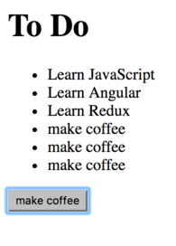
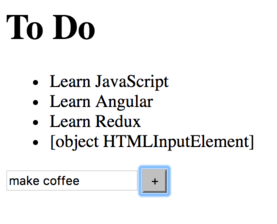
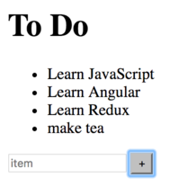

<!-- .slide: data-background="./images/title-slide.jpg" -->
<!-- .slide: id="events" -->
## Building Applications with Angular

# Handling Events

---
<!-- .slide: id="events-roadmap" -->
## Roadmap

1. How do I handle events?
1. How do I handle user input?
1. How do I make a reusable component?
1. How do child components send data to their parents?
1. How do I use two-way data binding?

---
<!-- .slide: id="events-handling-events" -->
## Handling Events

- Bind an expression to any DOM event using `(event)="action"` in a tag
- `event` is what to handle
- `action` is what to do
  - Almost always a method call

---
<!-- .slide: id="events-adding-items-1" -->
## Adding Items to the List

- Create a button
- Have its `click` event call `addToDo` with a fixed string

##### _src/app/to-do-list/to-do-list.component.html_
```html
<ul>
  <li *ngFor="let item of thingsToDo; let i = index" id="{{i}}">{{item}}</li>
</ul>
<button (click)="addToDo('make coffee')">make coffee</button>
```

---
<!-- .slide: id="events-adding-items-2" -->
## Adding Items to the List

- Create the corresponding method in the component class

##### _src/app/to-do-list/to-do-list.component.ts_
```ts
export class ToDoListComponent implements OnInit {
  // ...as before...

  addToDo(text: string) {
    this.thingsToDo.push(text);
  }
}
```



---
<!-- .slide: id="events-adding-specific-items-1" -->
## Adding Specific Items

- Add an `input` field
- Create a local variable *in the template* to hold its value using `#newItem`
  - `newItem` is *not* a member of the component class
- Modify the method call to pass that variable

##### _src/app/to-do-list/to-do-list.component.html_
```html
// ...as before...
<p>
  <input #newItem placeholder="item"/>
  <button (click)="addToDo(newItem)">+</button>
</p>
```

---
<!-- .slide: id="events-adding-specific-items-2" -->
## Adding Specific Items

- Fill in the input field
- Click the button



- Oops

---
<!-- .slide: id="events-adding-specific-items-3" -->
## Adding Specific Items (Fixed)

- `newItem` is a whole object, not just the text
- use `text.value` in `addToDo`
  - and then clear it to empty out the input box


##### _src/app/to-do-list/to-do-list.component.ts_
```ts
export class ToDoListComponent implements OnInit {
  // ...as before...

  addToDo(text: HTMLInputElement) {
    this.thingsToDo.push(text.value);
    text.value = '';
  }
}
```

---
<!-- .slide: id="events-reusable-components" -->
## Making a Reusable Component

- A text input with a button feels like something we could re-use
- Want to have:
  - Button with user-specified label
  - Text input field
  - *Some way to get the data into the parent*
- Have the component emit events
- Angular presents them in the same way as built-in events like `click`

---
<!-- .slide: id="events-component-skeleton" -->
## Create the Component Skeleton

- `ng generate component genericInput`
- Creates `src/app/generic-input/*`

---
<!-- .slide: id="events-move-the-html" -->
## Move the HTML

##### _src/app/to-do-list/to-do-list.component.html_
```html
<ul>
  <li *ngFor="let item of thingsToDo; let i = index" id="{{i}}">{{item}}</li>
</ul>
<app-generic-input></app-generic-input>
```

##### _src/app/generic-input/generic-input.component.html_
```html
<p>
  <input #newItem placeholder="item"/>
  <button (click)="addToDo(newItem)">+</button>
</p>
```

---
<!-- .slide: id="events-move-the-method" -->
## Move the Method

- Remove `addToDo` from `ToDoListComponent`
- Put it in `GenericInputComponent`

##### _src/app/generic-input/generic-input.component.ts_
```ts
export class GenericInputComponent implements OnInit {
  // ...as before...
  addToDo(text: HTMLInputElement) {
    this.thingsToDo.push(text.value);
    text.value = '';
  }
}
```

- Causes a compilation error because `GenericInputComponent` doesn't have `thingsToDo`

---
<!-- .slide: id="events-create-event-emitter-1" -->
## Create an Event Emitter

##### _src/app/generic-input/generic-input.component.ts_
```ts
import { Component, OnInit, Output, EventEmitter } from '@angular/core';

@Component({
  // ...as before...
})
export class GenericInputComponent implements OnInit {

  @Output() newItem: EventEmitter<string> = new EventEmitter();

  // ...constructor and ngOnInit as before...

  addToDo(text: HTMLInputElement) {
    this.newItem.emit(text.value);
    text.value = '';
  }
}
```

---
<!-- .slide: id="events-create-event-emitter-2" -->
## A What?

- `EventEmitter` can send things to anyone who's listening
- Class is *generic*
  - Must provide an actual type for events as in `EventEmitter<string>`
- `GenericInputComponent` is now emitting events, but nobody is listening

---
<!-- .slide: id="events-refactor" -->
## Refactor the Main Application

1. Move `<app-generic-input>` to `app.component.html`
   - I.e., make input and display siblings instead of nesting
   - Saves us one level of indirection
1. Add an event handler in `app.component.html`
   - Name is the name of the `@Output` member variable in `GenericInputComponent`

##### _src/app/app.component.html_
```html
<h1>{{title}}</h1>
<app-to-do-list [thingsToDo]="thingsToDo"></app-to-do-list>
<app-generic-input (newItem)="onNewItem($event)"></app-generic-input>
```

- The `onNewItem` event handler is a public method on the `AppComponent` class
- `$event` is a special Angular variable that represents the value emitted by the captured event
  - In our case, the string inputted by the user

---
<!-- .slide: id="events-connect-the-wires" -->
## Connect the Wires

##### _src/app/app.component.ts_
```ts
export class AppComponent {

  title = 'To Do';
  thingsToDo = [
    'Learn JavaScript',
    'Learn Angular',
    'Learn Redux'
  ];

  onNewItem(item: string) {
    this.thingsToDo.push(item);
  }
}
```

- No other changes needed

---
<!-- .slide: id="events-final-appearance" -->
## Final Appearance



FIXME: diagram showing data flow

---
<!-- .slide: id="events-quiz-1" -->
<!-- .slide: data-background="./images/question-slide.jpg" -->

## Quiz

Which of the following is invalid syntax for handling an event?

1. `<message (messageSent)="onMessageSent($event)"></message>`

2. `<message (messageSent)="onMessageSent(message)"></message>`

3. `<message messageSent="onMessageSent($event)"></message>`

4. `<message (messageSent)="sent=$event"></message>`

--
<!-- .slide: data-background="./images/answer-slide.jpg" -->

## Answer

Correct answer is 3.

1: Values emitted are exposed via the `$event` variable.

2: This answer may expose a misunderstanding that values referenced as
callback arguments are class members.

3: Not choosing this answer may expose confusion in terms of inputs
vs. outputs, and/or two-way bound `[()]` properties.

4: This answer may expose a misunderstanding that values passed into
outputs must be callbacks. In reality, they are simply expressions
which also have special handling for callback syntax

---
<!-- .slide: id="events-quiz-2" -->
<!-- .slide: data-background="./images/question-slide.jpg" -->

## Quiz

What is the difference between:

(A) `<counter [count]="count()"></counter>`

(B) `<counter (count)="count()"></counter>`

1. None.

2. (A) passes the result of calling `this.count()` into the `<counter>` component via an input.
   (B) calls `this.count()` whenever the `<counter>` component emits a value through its own `EventEmitter` member `count`.

3. (A) calls `this.count()` whenever the `<counter>` component emits a value through its own `EventEmitter` member `count`.
   (B) passes the resulting value of calling `this.count()` into the `<counter>` component via an input.

4. (A) emits a value from the parent into the `<counter>` component from an `EventEmitter` member called `count`.
   (B) assigns values emitted from the `<counter>` component to `this.count`.

--
<!-- .slide: data-background="./images/answer-slide.jpg" -->

## Answer

Correct answer is 2.

1, 3, 4: This answer may expose a misunderstanding of the input `[]`
output `()` paradigm and what the syntax represents.

---
<!-- .slide: id="events-quiz-3" -->
## Question

Given the following components, which message will be logged to the console when `child`'s button is clicked?

```ts
@Component({
  selector: 'parent',
  template: '<child (messageSent)="handleMessageSent($event)"></child>'
})
export class Parent {
  @Output() messageSent = new EventEmitter();
  message = 'I am the parent';
  handleMessageSent() { console.log(this.message); }
}

@Component({
  selector: 'child',
  template: '<button (click)="sendMessage()">Click me</button>'
})
export class Child {
  @Output() messageSent = new EventEmitter();
  message = 'I am the child';
  handleMessageSent() { console.log(this.message); }
  sendMessage() { this.messageSent.emit(true); }
}
```

---
<!-- .slide: id="events-quiz-4" -->
<!-- .slide: data-background="./images/question-slide.jpg" -->

## Quiz (continued)

1. I am the child

2. I am the parent<br>
   I am the child

3. I am the child<br>
   I am the parent

4. I am the parent

--
<!-- .slide: data-background="./images/answer-slide.jpg" -->

## Answer

Correct answer is 4.

1: This answer may expose confusion between which component actually
handles the event.

2,3: This answer may expose a misunderstanding that both child and
parent components are able to listen to the custom event, and thus
both log their messages.
