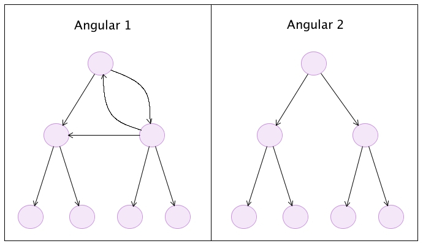

<!-- .slide: data-background="./slide/images/background.jpg" -->
<!-- .slide: id="change-detection" -->

# Angular Advanced

## Change Detection

---

## History

* **Angular 1**: the framework kept a long list of watchers (one for every property bound to our templates) that needed to be checked every-time a digest cycle was started. This was called dirty checking and it was the only change detection mechanism available. Models were able to change directives, directives were able to change models, directives were able to change other directives and models were able to change other models.

* **Angular**: the flow of information is unidirectional, our code is responsible for updating the models. Angular is only responsible for reflecting those changes in the components and the DOM by means of the selected change detection strategy.

---

## Change Detection (Angular 1 vs 2)



* Angular 1: Two-way data binding. Nodes traversed one or more times.
> 10 $digest() iterations reached. Aborting!

* Angular 2+: One-way data binding. Nodes traversed once.(root first)

---

## Angular Change Detection

[change detector example](http://plnkr.co/edit/XvSEu0GbAEIaOxMRSgBI?p=preview)


---

## Conceptual Model of Change Detector

```ts
class AppComponent_ChangeDetector {

  constructor(
    public previousSlogan: string,
    public previousTitle: string,
    public previousActor: Actor,
    public movieComponent: MovieComponent
  ) {}

  detectChanges(slogan: string, title: string, actor: Actor) {
    if (slogan !== this.previousSlogan) {
      this.previousSlogan = slogan;
      this.movieComponent.slogan = slogan;
    }
    if (title !== this.previousTitle) {
      this.previousTitle = title;
      this.movieComponent.title = title;
    }
    if (actor !== this.previousActor) {
      this.previousActor = actor;
      this.movieComponent.actor = actor;
    }
  }
}
```

---

## Change Detection Strategy: OnPush

``` ts
@Component({
  // ...
  changeDetection: ChangeDetectionStrategy.OnPush
})
export class MovieComponent {
  // ...
}
```

[Example](http://plnkr.co/edit/yjr8R6LhWpOKcGnAwYNS?p=preview)

---

## Immutable Component

If a component depends only on its input properties, and they are immutable, then this component can change if and only if one of its input properties changes.

``` ts
@Component({changeDetection:ChangeDetectionStrategy.OnPush})
class ImmutableTodoCmp {
  todo:Todo;
}
```

---

## Observable Component

```ts
type ObservableTodo = Observable<todo>;
type ObservableTodos = Observable<array>>;

@Component({selector:'todos'})
class ObservableTodosCmp {
  todos:ObservableTodos; //...
}
```

```html
<todo *ngFor="let t of todos" todo="t"></todo>
```

## Summary

* An Angular 2 application is a reactive system.
* The change detection system propagates bindings from the root to leaves.
* Unlike Angular 1.x, the change detection graph is a directed tree. As a result, the system is more performant and predictable.
* By default, the change detection system walks the whole tree. But if you use immutable objects or observables, you can take advantage of them and check parts of the tree only if they “really change”.
* These optimizations compose and do not break the guarantees the change detection provides.

---

## Additional Resources

To learn more about change detection, visit the following links (in order of relevance):

* [NgConf 2014: Change Detection (Video)](https://www.youtube.com/watch?v=jvKGQSFQf10)
* [Angular API Docs: ChangeDetectionStrategy](https://angular.io/docs/ts/latest/api/core/index/ChangeDetectionStrategy-enum.html)
* [Victor Savkin Blog: Change Detection in Angular 2](http://victorsavkin.com/post/110170125256/change-detection-in-angular-2)
* [Victor Savkin Blog: Two Phases of Angular 2 Applications](http://victorsavkin.com/post/114168430846/two-phases-of-angular-2-applications)
* [Victor Savkin Blog: Angular, Immutability and Encapsulation](http://victorsavkin.com/post/133936129316/angular-immutability-and-encapsulation)
* [Immutability vs Encapsulation in Angular Applications](https://vsavkin.com/immutability-vs-encapsulation-90549ab74487)

---
* [reference](https://angular-2-training-book.rangle.io/handout/change-detection/) sfdf
https://angular-2-training-book.rangle.io/handout/advanced-angular/
https://blog.thoughtram.io/angular/2016/02/22/angular-2-change-detection-explained.html