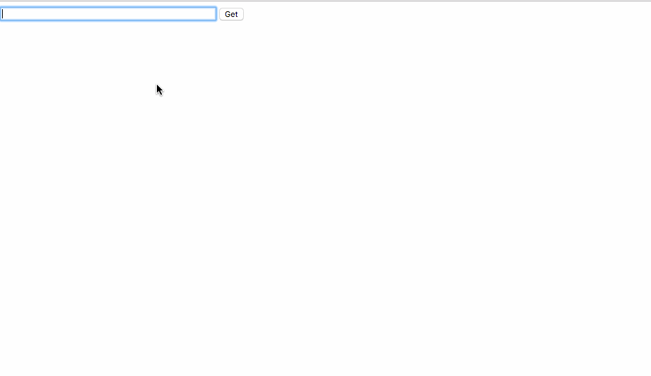

# HTTP Service

Create a component that has a button that when pressed uses a service to make an HTTP request to retrieve JSON from a RESTful API and displays the result.

## Step 1

Using the `angular-cli` create a new project called `http-service` inside of the `training` folder.

## Step 2

Using the `angular-cli` create a new service called `http-client` in the `http-service` project.  Notice that `app.module.ts` was not updated to import or provide the new `http-client` service.

## Step 3

Update `app.module.ts` to import and provide the `http-client` service.

## Step 4

Update `app.component.ts` to have `inputUrl` and `output` string properties and a `show` boolean property (initialized to `false`). Add a method called `onGetClick()`.

## Step 5

Update `app.component.html` to have an `input` element of type `text`, a `button`, and a `p` element.  

## Step 6

Update `app.component.html` to use `NgModel` to connect the `input` element to the `inputUrl` property.  Set the `button` click event to call the `onGetClick()` method.  Make the `p` element conditionally present based on the `show` property using `NgIf` and make the content equal to the `output` property.  Update `app.component.css` to set the input to have width of 300px.

## Step 7

Update `app.component.ts` to import and inject the `HttpClientService`.

## Step 8

Update `http-client.service.ts` to import and inject the `Http` service.  Add a method called `get` that takes a string parameter (url) and calls `Http.get()` on that url string.

## Step 9

Add two methods to `HttpClientService`, `onResponse`, which takes a `Response` parameter and returns a string (the body of the `Response`), and `onError`, which takes `Response | any`, and returns an Observable that contains the error mesage (hint: `Observable.throw` may be useful, to use it you'll need to import the `throw` Observable operator).

## Step 10

Import `map` and `catch` Observable operators to `http-client.service.ts` and use them in `get()` after `Http.get()` to map the responses to `onResponse` and the errors to `onError`

## Step 11

Update `app.component.ts` to add `onGotResponse` and `onGotError` methods to set the content to the `output` property and set the `show` property to `true`

## Step 12

Update `app.component.ts` to have the `onGetClick()` method to call the `HttpClientService.get()` and subscribe to the result with the responses calling `onGotResponse` and `onGotError` as appropriate.

Note: to test you can use either [Mocky](http://www.mocky.io/) or [JSONPlaceholder](https://jsonplaceholder.typicode.com/).  If using Mocky, remember to set a header `Access-Control-Allow-Origin` with value set to the url of the test-app (http://localhost:4200/), JSONPlaceholder does that automatically 
